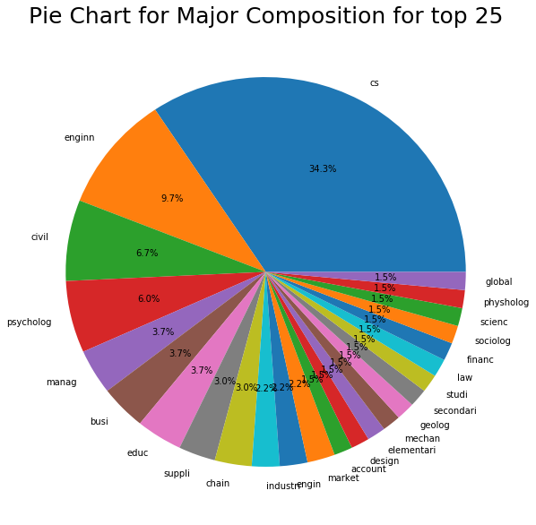

# Dreams of GLG101 class 2018

This is a fun project that I did while I was TAing for GLG101 class at ASU in Spring 2018.

During one of the class we had a in class exercise where students are required to submit a piece of paper answering what the major in and what their dream job would be if money and security is of no concern.

I collected all the papers and digitised them and during this process, I negelected some details and made some generalization of their description.

I started this project out of curicity for the following questions:
* What is the class major composition
* What is the most commonly used words to describe dreams
* Are we working on our dreams?

What is the class major composition
What is the most commonly used words to describe dreams
Are we working on our dreams?
This project uses NLTK package to do the natural language processing and many thanks to the tutorial by [bonzanini](https://github.com/bonzanini/nlp-tutorial).
